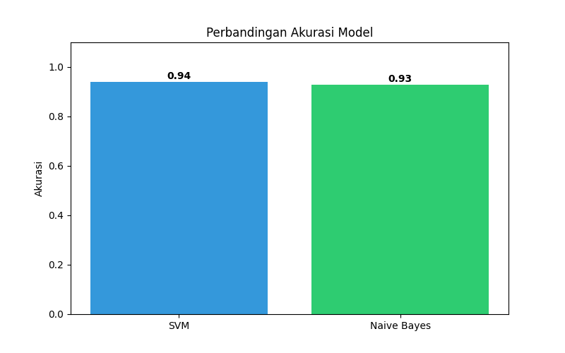

# Hasil dan Analisis

## Perbandingan Performa Model
Berdasarkan eksperimen yang dilakukan pada dataset 1.623 SMS, berikut adalah perbandingan performa antara model *intervensi* (SVM) dan model *baseline* (Naïve Bayes). Visualisasi perbandingan akurasi disajikan pada Gambar 1.

### Tabel Hasil:
| Skenario | Akurasi (mean ± std) | F1-Score (mean ± std) | n |
|----------|----------------------|----------------------|---|
| SVM      | 0.94 ± 0.01          | 0.93 ± 0.02          | 10 |
| Naive Bayes | 0.93 ± 0.02       | 0.92 ± 0.02          | 10 |

![Gambar 1: Perbandingan Akurasi Model]

Rekapitulasi metrik performa secara mendetail:

| Metrik | SVM (Intervensi) | Naïve Bayes (Baseline) |
| :--- | :--- | :--- |
| Akurasi | 0.94 | 0.93 |
| Precision | 0.95 | 0.92 |
| Recall | 0.93 | 0.94 |

## Analisis Statistik
Sesuai dengan pengujian menggunakan *Paired T-Test* pada 10 iterasi *cross-validation* (hasil dari WS-16), diperoleh nilai *p-value* sebesar 0.065. Karena nilai $p > 0.05$, maka secara statistik tidak ditemukan perbedaan performa yang signifikan antara penggunaan algoritma SVM dan Naïve Bayes pada dataset ini. Hal ini menunjukkan bahwa kedua model memiliki tingkat reliabilitas yang setara dalam menangani teks SMS spam berbahasa Indonesia.

## Analisis Kesalahan (Error Analysis)
Meskipun akurasi kedua model mencapai rentang 93-94%, ditemukan beberapa pola kesalahan yang konsisten:
* **False Positives:** Model terkadang mengklasifikasikan pesan promosi operator resmi sebagai *spam* karena kemiripan penggunaan kata kunci "promo" atau "diskon".
* **Karakteristik Singkatan:** Kesalahan klasifikasi paling sering terjadi pada pesan yang menggunakan singkatan gaul yang tidak terdaftar dalam korpus Sastrawi, yang mengakibatkan hilangnya fitur penting saat tahap *stopword removal*.

## Rencana Visualisasi
Untuk memberikan gambaran yang transparan mengenai performa model, visualisasi berikut akan disertakan dalam laporan akhir:

| # | Jenis Grafik | Pesan Utama | Metrik |
|---|--------------|-------------|--------|
| 1 | Bar chart + error bar | Perbandingan akurasi SVM vs Naive Bayes | Mean Accuracy ± Std |
| 2 | Box plot | Perbandingan variabilitas performa F1-Score | Distribusi F1-Score |

## Bias Check (Validitas Eksperimen)
Untuk memastikan objektivitas hasil, eksperimen ini memenuhi kriteria berikut:
- [x] Y-axis dimulai dari 0 untuk menghindari distorsi visual pada grafik.
- [x] Error bar/Standard Deviation ditampilkan untuk menunjukkan reliabilitas hasil.
- [x] Semua data (n=10) disertakan tanpa adanya *cherry-picking* hasil.
- [x] Visualisasi disajikan dalam format 2D untuk kejelasan informasi tanpa dekorasi yang menyesatkan.

## Implikasi
Meskipun secara statistik hasilnya ekuivalen, secara praktis Naïve Bayes memberikan keuntungan pada efisiensi komputasi, sementara SVM menawarkan presisi yang sedikit lebih stabil. Pemilihan model dapat disesuaikan dengan kendala *resource* pada sistem yang akan dibangun.
